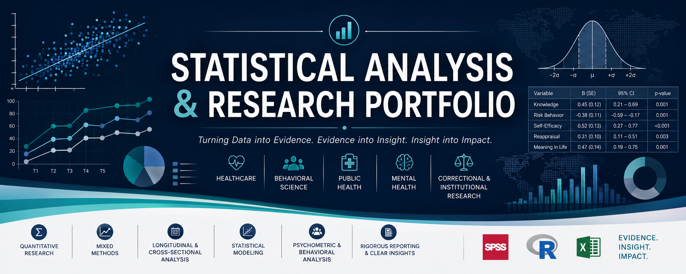

 
# 📊 Statistical Analysis & Research Portfolio

I specialize in applied statistical analysis, research methodology support, and data interpretation for healthcare, behavioral science, mental health, public health, and institutional research projects.

My work focuses on designing rigorous analytical frameworks, applying appropriate statistical methods, and translating complex findings into actionable insights for research, policy, programme development, and evidence-based decision-making.

---

# 🔬 Areas of Expertise

- Quasi-experimental and longitudinal analysis  
- Cross-sectional and correlational research  
- Mixed-methods research support  
- Behavioral and psychosocial data analysis  
- Mental health and intervention evaluation  
- General Linear Models (GLM), ANOVA, ANCOVA  
- Ordinal logistic regression and association analysis  
- Chi-square and nonparametric analysis  
- Psychometric and scale-based analysis  
- Research methodology consultation  
- Statistical reporting and interpretation  
- Data visualization and analytical storytelling  

---

# 📁 Featured Projects

## 🔹 EMDR Therapy & PTSD Intervention Analysis

Statistical evaluation of a quasi-experimental longitudinal study assessing EMDR therapy effectiveness among ICU healthcare professionals.

👉 [View Repository](https://github.com/R-Ushindi/EMDR-Intervention-Cameroon)

---

## 🔹 Sexual Health Knowledge & Risk Behaviour Study

Methodological and statistical support for a mixed-methods public health study examining sexual health knowledge, behavioral risk patterns, and socio-demographic predictors among young adults in Kenya.

*(Portfolio repository in preparation.)*

---

## 🔹 Emotional Self-Regulation & Meaning in Life Among Male Inmates

Quantitative correlational analysis examining relationships between emotional regulation profiles and meaning in life among incarcerated men in a Kenyan correctional setting using validated psychometric instruments and chi-square analysis.

*(Portfolio repository in preparation.)*

---

# 🛠 Analytical Tools & Workflow

## Core Analytical Tools

- **SPSS**  
- **R**  
- **Excel**  
- **Google Forms**  
- **Microsoft Word**  
- **PowerPoint**  

These tools are used across different stages of projects including data collection, cleaning, validation, statistical analysis, visualization, interpretation, reporting, and presentation development depending on project requirements and analytical needs.

---

## Typical Analytical Workflow

1. Research design and analytical planning  
2. Data collection and organization  
3. Data cleaning and quality validation  
4. Statistical analysis and assumption testing  
5. Visualization and interpretation of findings  
6. Technical reporting and presentation development  
7. Translation of findings into actionable insights  

---

# 📌 Approach

Each project in this portfolio demonstrates:

- Clear research framing  
- Structured analytical planning  
- Appropriate statistical method selection  
- Transparent analytical workflow  
- Integration of statistical and practical interpretation  
- Ethical handling of sensitive data  
- Decision-relevant reporting and communication  

---

# 🌍 Research Contexts

Projects represented in this portfolio include work conducted within:

- Healthcare systems  
- Academic institutions  
- Public health settings  
- Mental health research  
- Correctional and rehabilitation contexts  
- Vulnerable and high-risk populations  

---

# 📫 Contact

Open to:

- Statistical consultancy  
- Research collaborations  
- Academic research support  
- Healthcare and public health analytics  
- Behavioral and psychosocial research projects  
- Mixed-methods research support  
- Data analysis and reporting engagements
